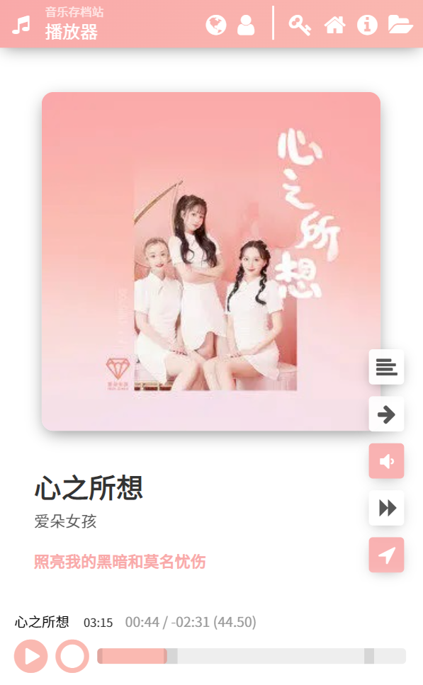

TOXIC Music Player 1 (txmp)
===========================

![][latest_version] ![][build_date]  
[![][license]][license_link] ![][dev_php_version]![][should_work_php_version]
![][rp_kuwo] ![][rp_kuwo_date] ![][rp_kuwo_hack_level]

[latest_version]: https://img.shields.io/badge/Version-v128a%20pre16-orange.svg?style=flat-square
[build_date]: https://img.shields.io/badge/Build%20Date-20220719-blue.svg?style=flat-square
[dev_php_version]: https://img.shields.io/badge/PHP-7.4.9-green.svg?style=flat-square
[should_work_php_version]: https://img.shields.io/badge/7.1+-lightgreen.svg?style=flat-square
[license]: https://img.shields.io/badge/License-MIT%20License-green.svg?style=flat-square
[license_link]: https://mit-license.org/

[rp_kuwo]: https://img.shields.io/badge/RemotePlay-Kuwo%20Music-orange.svg?style=flat-square
[rp_kuwo_date]: https://img.shields.io/badge/API%20On-20211030-orange.svg?style=flat-square
[rp_kuwo_hack_level]: https://img.shields.io/badge/Hack%20Level-pay_play-yellow.svg?style=flat-square

Changelog (in Chinese): [changelog.txt](./changelog/changelog.txt)

 

## What's this project about?

TOXIC Music Player is a Apache-PHP based application used for establishing your unique **personal music archive site**, which can be used anywhere, by your phone or PC.

Songs could be upload by an Administrator (YOU), and can also be crawled from Kuwo Music. This feature is called RemotePlay.

For other users visiting your music archive site, they could access your uploaded songs if your configuration allows, and can access and download any songs from RemotePlay. They could use it as a download site of Kuwo Music.

## Disclaimer

The application comes with some hacks. All features or files provided by this application is only for nonprofit testing and education purposes. YOU should take full responsibility for abusing it.

I do not take responsibility for misfunctioning or server attacks utilizing issues of this application.

## System Requirements

### Server

- Apache-PHP environment.
- PHP ≥ 7.
- `.htaccess` support.
- `mod_rewrite` support.

### Client (PC)

Webkit based browser, or Firefox, the last two versions.

### Client (Android)

Microsoft Edge (recommended), the last two versions; or Google Chrome ≥ 82.

### Client (iOS)

AppleWebkit on iOS **is not officially supported**. You may try it, but don't report any issues about that (except for issues concerning standard mistakes).

## Want to have a try?

You may go to the demo site (the demo site is in production use and does not demo administration features).

[Go to demo site](https://ak-ioi.com/apps/music/)

[View changelogs on demo site](https://ak-ioi.com/apps/music/version-history)

## What does it look like?

See [gallery](./_docs/gallery/) for more screenshots.

## How to install & use?

See [documentation](./_docs/documentation/) for instructions.

It may not be very easy to use without reading documentations.

*Enjoy!*
