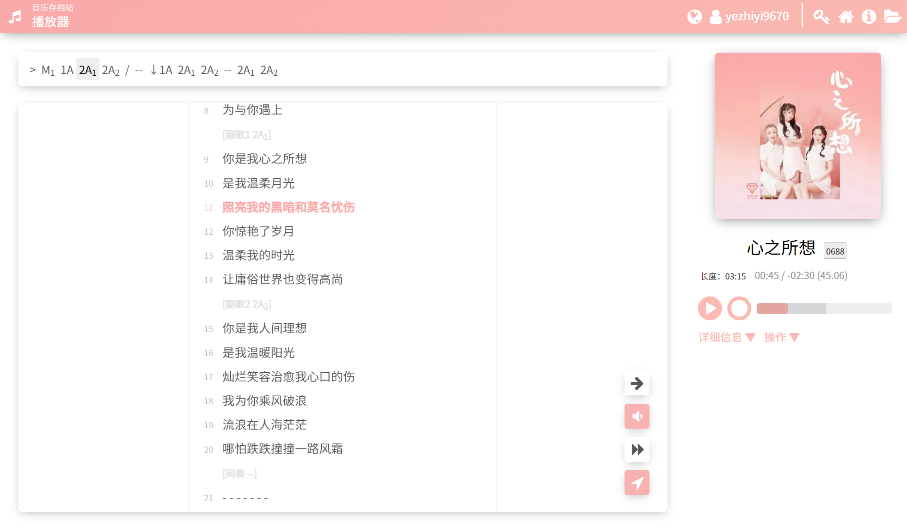

`txmp.docs / gallery`

# Walkthrough of Screenshots

> Historical materials:
>
> - [Legacy Showcase](./historical-introduction.md)
> - [A Brief History of the UI](./brief-history-of-ui.md)

Some outdated images might be found here. If so, they will be updated on the next release.

## Music Discovery

This is the homepage, where visitors find songs.

### Internally Stored Songs

▲ They show as a list

### Kuwo Music RemotePlay

▲ Find songs on Kuwo Music using search

### ID Search

▲ Find a certain song by ID quickly

## User System and Playlist

Users can login and store playlists.

### Login Screen

▲ Note: Register can be disabled.

### User Center

▲ List your personal playlists here.

### Change Password

▲ Change password, and even delete your account (this will wipe all data).

### User Settings

▲ Optimize by yourself. Device based and not synchronized with account.

### List Editor

▲ Temporary playlist, with data stored in URL.

▲ Online playlist.

▲ You may use your keyboard.

## Player

▲ Player on PC, clean layout. Administrator-uploaded songs may use paragraphing.

 

▲ Title menu (click title to open) and playlist menu.

 

▲ Mobile player with two pages.

## Administration and Uploading

### Song Administration

▲ Administrator list of songs.

▲ Querying issues.

▲ Querying annotations.

### Uploading

▲ Upload audio and cover image.

▲ Edit metadata and lyrics.

▲ Control access of other visitors.

## Additional Features

### Generate Lyrics Book

▲ Generate your very own lyrics book, printable! (Supports only Chinese)

### Debug Code View

