`txmp.docs / gallery`

# Legacy Showcase

This is from the legacy repository.

v110a: Legacy player.  
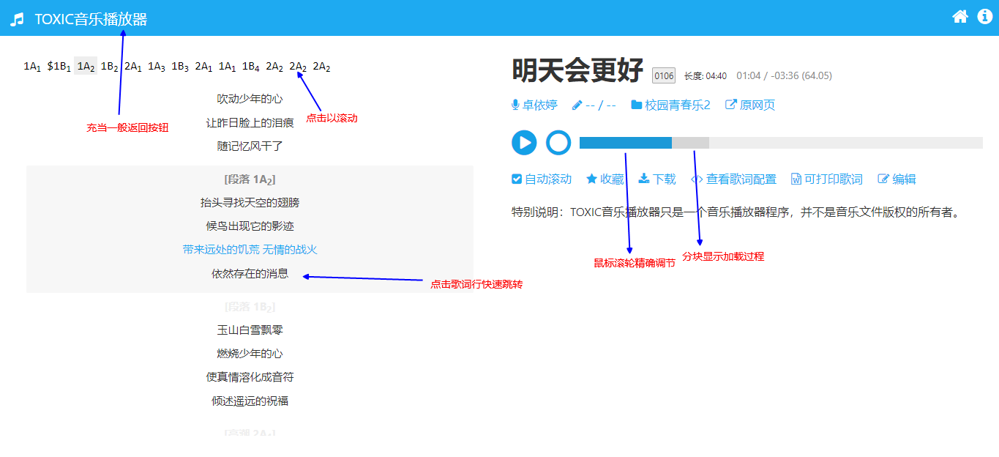

v110a: Per-song color.  
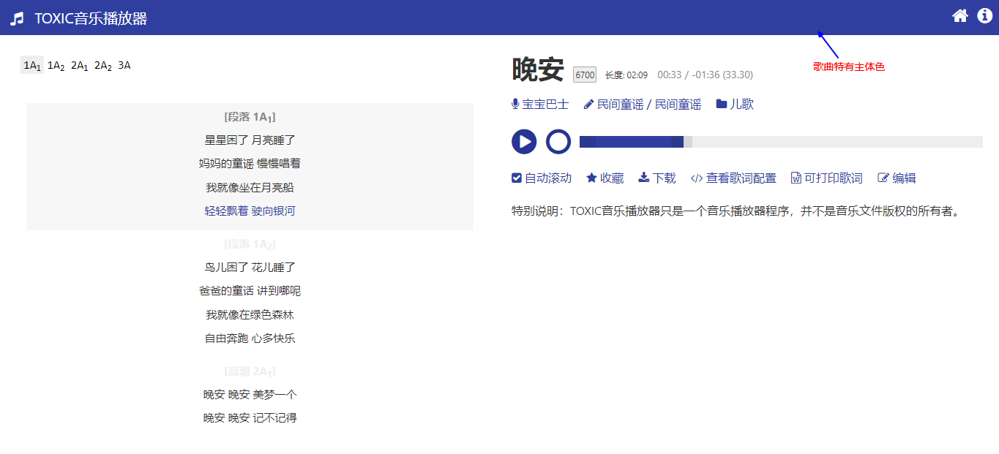

v110a: Avoid using JSON directly.  
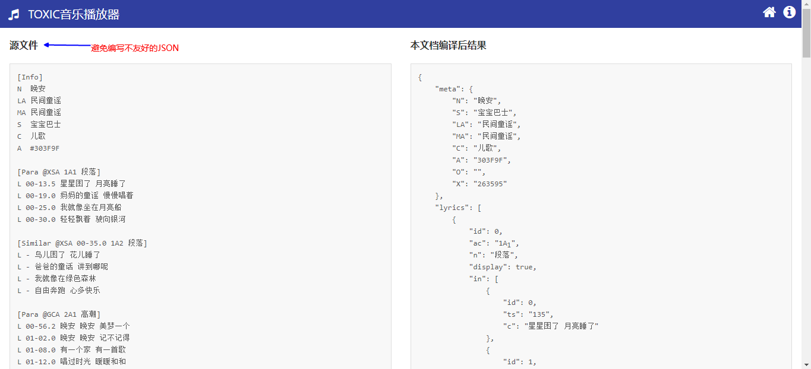

v110b: Generate printable document for single song.  
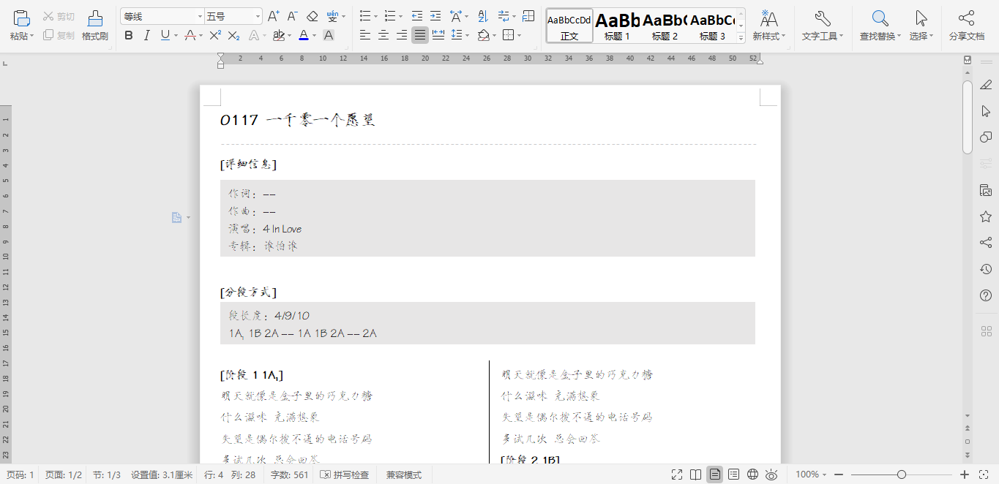

v113a: Convenient administration.  
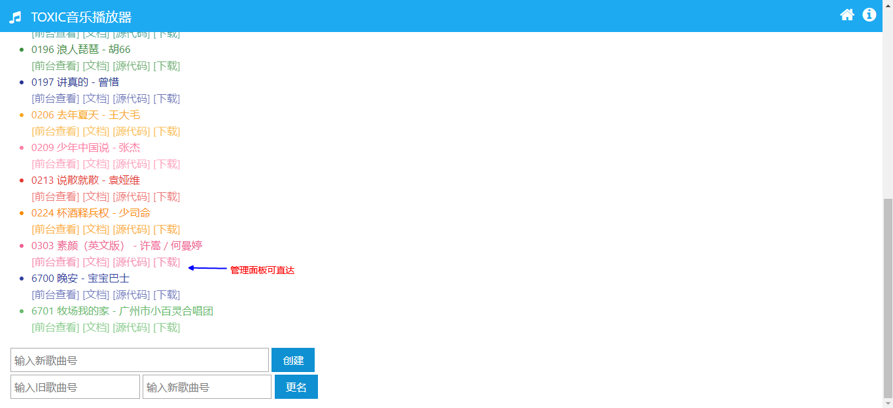

v113a: Convenient editor.  
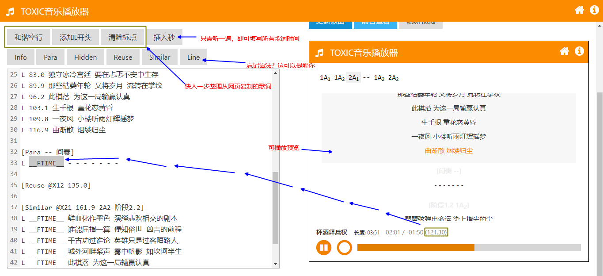

v115a: Playlist (experimental).  
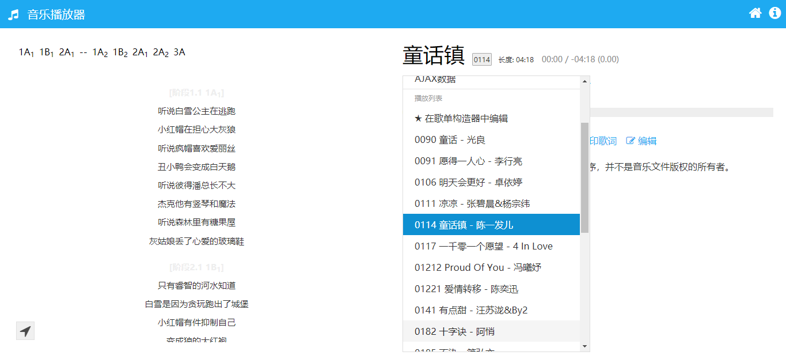

v117a: Grab songs from Kuwo Music!  
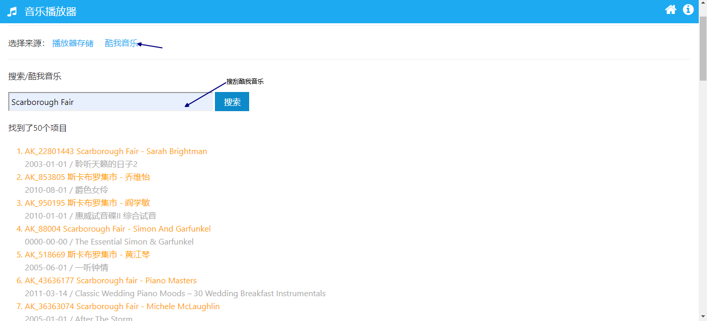

v123a: Simple and 'modern' player.  
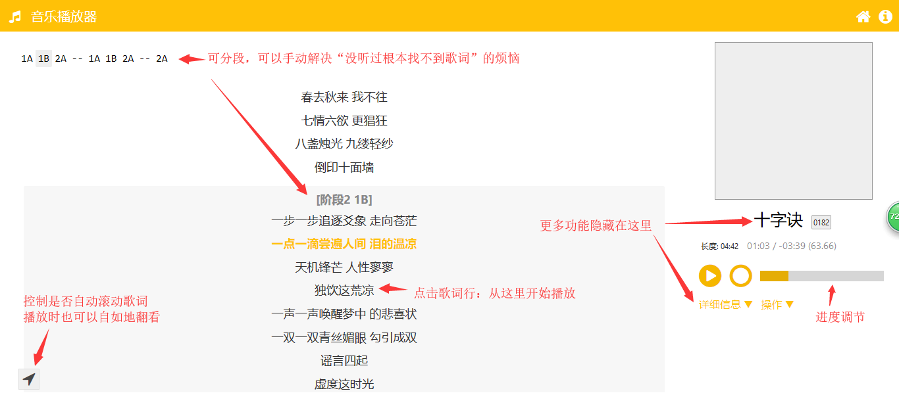

v123a: Dropdown features in player.  
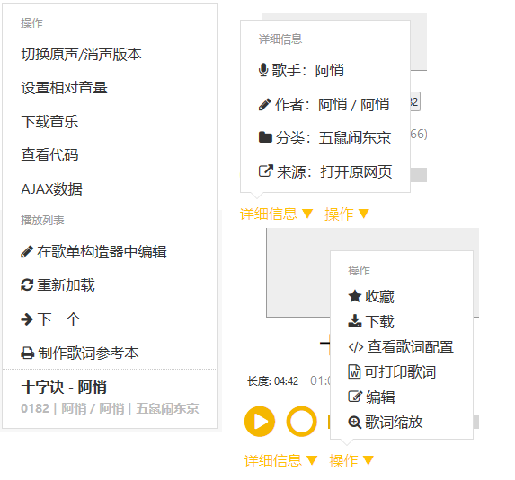

v123a/v122e: Full firefox support.  
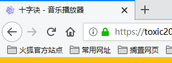

v123a/v110a: Minimalistic code.  
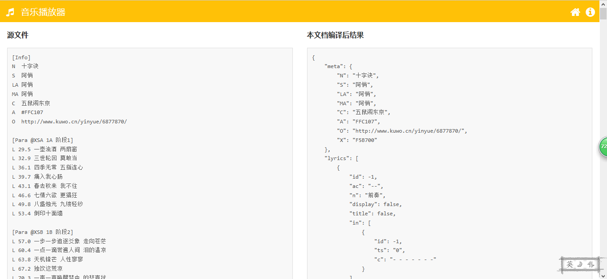

v123a/v110a: Paper-saving printable document.  
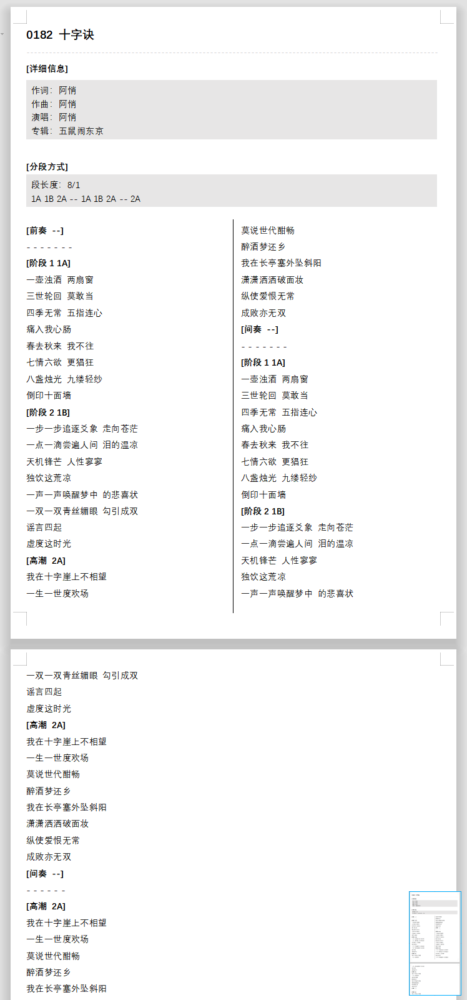

v123a: Zoom the text for different display sizes.  
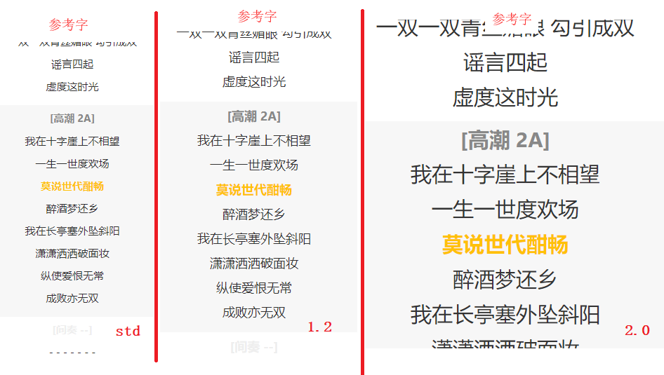

v123a/v110a: Per-song color.  

v123a/v117a: Grab stuff from Kuwo Music. Supports direct download!  
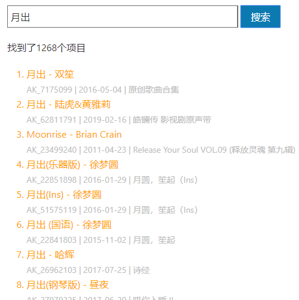

v123a/v115a: Playlists! (Currently only 200 items)  
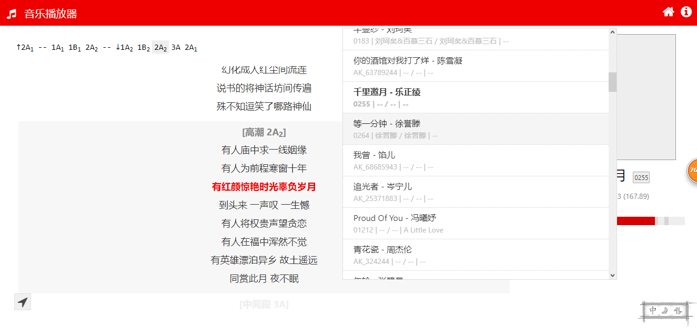

v123a/v117a: Printable lyrics book.  
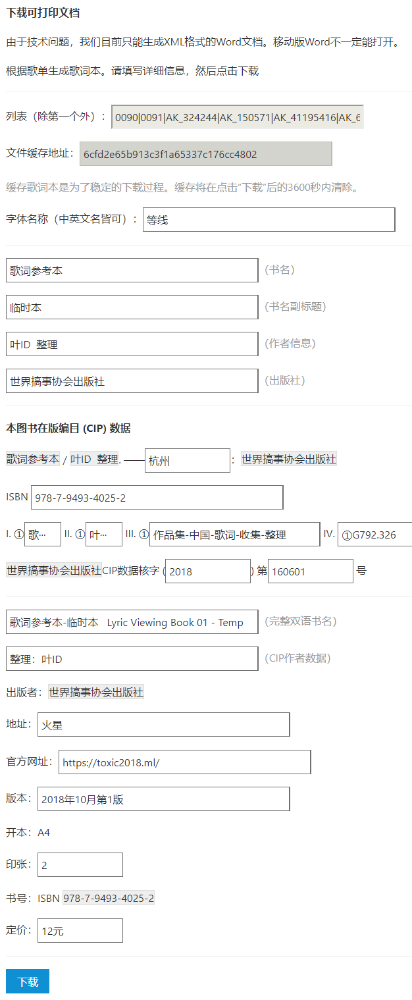

v123a/v120a: Save playlists online with RojExplorer.  
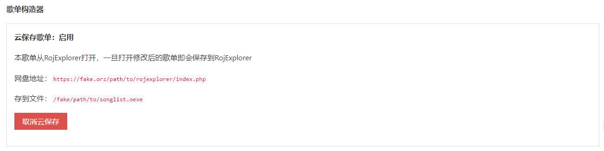
